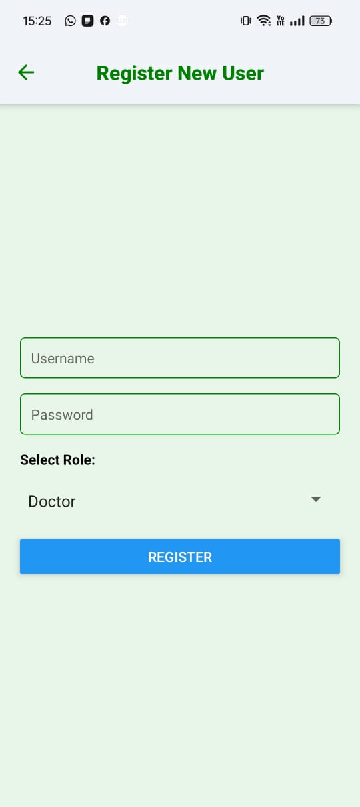
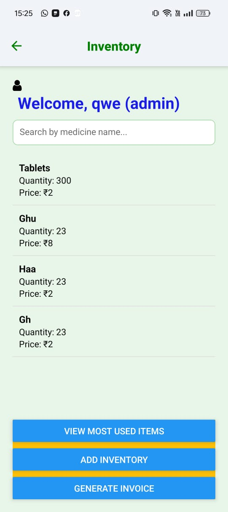
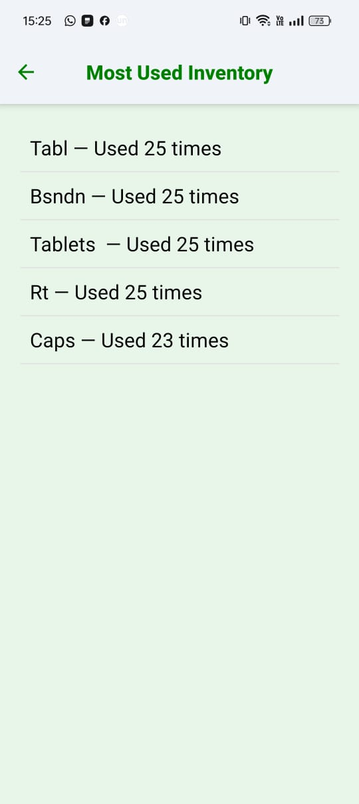
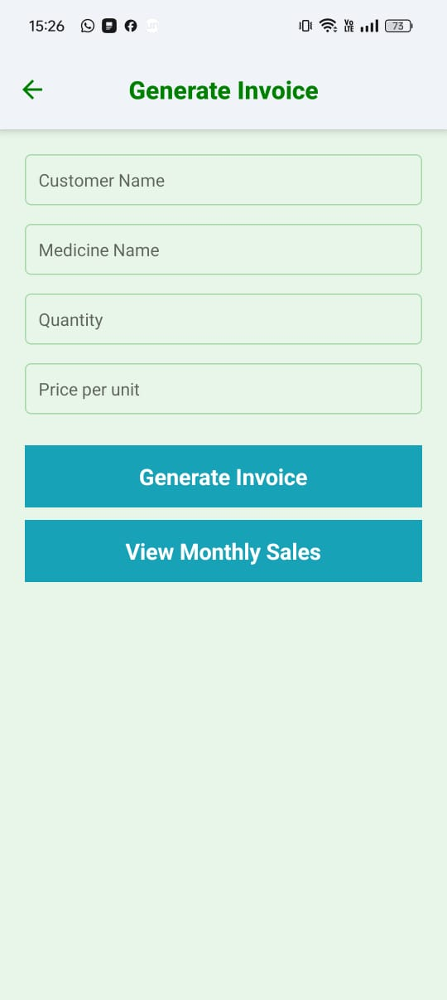
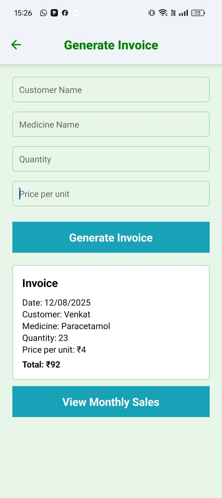
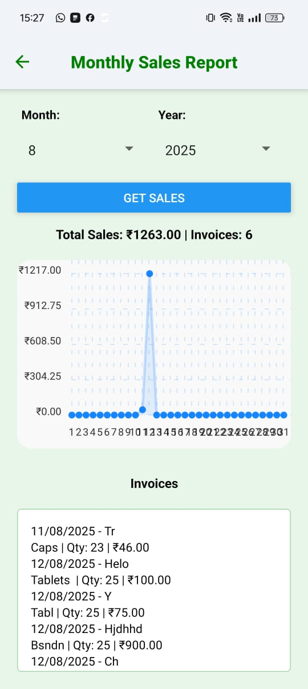
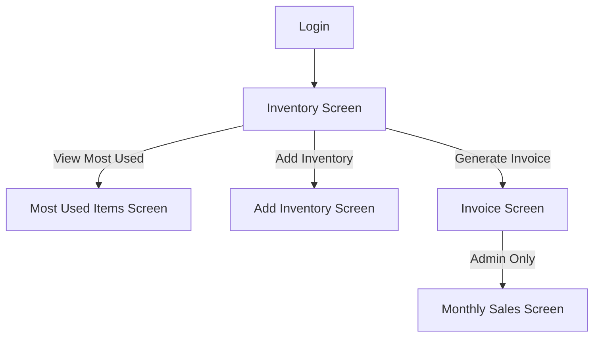

# 💊 Pharmacy Inventory & Invoice Management App

A modern **React Native** application for pharmacies and clinics to **manage inventory**, **generate invoices**, and **track monthly sales** — built with **role-based access** so admins and pharmacy staff can easily collaborate.

---

## 🚀 Features

### **Inventory Management**
- View live inventory list with quantity and price.
- Role-based actions:  
  - **Admin / Pharmacy:** Add inventory, generate invoices.  
  - **Staff:** View inventory, check usage stats.
  - **Staff:** Can View monthly sales with visulization

### **Invoice Generation**
- Generate professional invoices instantly.
- Calculates total based on quantity × price per unit.
- Saves invoices via backend API.
- Displays the last generated invoice on-screen.

### **Monthly Sales Tracking**
- Admins can view **monthly sales analytics** for better decision-making.
- Planned: Graphical charts for visualizing revenue trends.

---

## 🛠 Tech Stack
- **Frontend:** React Native (Expo / CLI)
- **Navigation:** React Navigation
- **State & Hooks:** React Hooks (`useState`, `useCallback`, `useFocusEffect`)
- **API Integration:** Custom API layer (`fetchInventory`, `createInvoice`)
- **UI:** Native components + StyleSheet

---

## 📱 Screens Flow

### **1. Login & Role Detection**
➡️ **User logs in** → role (`admin`, `pharmacy`, `staff`) is determined.

### **2. Inventory Screen**
- Shows all available medicines.
- Buttons visible based on role:
  - **Most Used Items** (All)
  - **Add Inventory** (Admin / Pharmacy)
  - **Generate Invoice** (Admin / Pharmacy)

### **3. Invoice Screen**
- Fill in: Customer Name, Medicine, Quantity, Price/Unit.
- Auto-calculates total.
- Displays invoice immediately after creation.
- Admins get **View Monthly Sales** button.

---

## 🧠 Thought Process

This project was designed with **real pharmacy workflows** in mind:
1. **Simplicity First** — Minimal learning curve for non-technical staff.
2. **Role-Based UX** — Prevents unauthorized access to sensitive features.
3. **Scalable Architecture** — API-driven, so backend can grow independently.
4. **Offline-Ready Potential** — Can be extended to work offline for rural pharmacies.
5. **Clean Code for Maintainability** — Each screen has single responsibility and reusable API calls.
6. **Backend**-Used mongoose for data handling like user data, inventory data, invoices--Most focus on frontend and prototype

---


## 📸 Screenshots

| Login Screen | Register Invoice | Inventory Display |
|--------------|------------------|-------------------|
|  |  |  |

| Mostused screen | Add Inventory | Invoice Screen |
|-----------|---------|----------|
|  |  |  |

| Generate invoice | Sales | Help |
|--------------|---------------|------|
|  |  |


---

## 🔄 App Flow Diagram



---

## 📦 Installation

After cloning the repository, make sure to update the **`BASE_URL`** in `api.js`.  
By default, it contains my system’s IPv4 address — this may prevent the backend from connecting on your machine.  
Either run the backend locally or replace it with **your own system’s IPv4 address**.

```bash
# Clone the repository
git clone https://github.com/yourusername/inventory-management.git

# Navigate into the project folder
cd inventory_management

# Install dependencies
npm install

# Start the app
npx expo start

```

---

## 🧩 Folder Structure

```
/src
  /api         # API calls (fetchInventory, createInvoice)
  /screens
    InventoryScreen.js
    InvoiceScreen.js
    MostUsedScreen.js
    AddInventoryScreen.js
    MonthlySalesScreen.js
  App.js
```

---

## 🔮 Future Enhancements
- 📊 More Interactive charts for sales & stock trends.
- 📄 PDF invoice export.
- ☁️ Cloud sync for multi-branch pharmacies.
- 🔔 Low-stock alerts via push notifications.
-    More interactive UI

---

